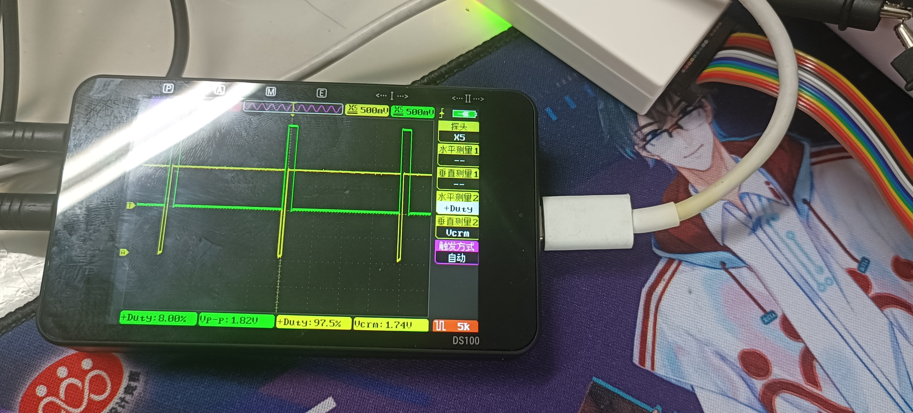

### 搞清楚ePWM工作，首先要搞清楚频率怎么设置
#### 我们有PWM 周期=（TBPRD+1）*T(TBCLK)

    TBPRD比较好知道，在ePWM初始化中唯一输入的参数就是他
    EPwm6Regs.TBPRD = tbprd;//设定 PWM 周期为 tbprd+1 个 TBCLK 时钟周期
    当然，这个初始化函数确实是别人写的，不过我们确实也是在结构体配置中完成了tbprd的配置
#### 那么，T 或者说是TBCLK的时钟，是多少呢？

这一部分我找了很久，终于找到了，由以下2个式子确定

    EPwm1Regs.TBCTL.bit.HSPCLKDIV=TB_DIV1;
	EPwm1Regs.TBCTL.bit.CLKDIV=TB_DIV1;
具体公式是

$x=HSPCLKDIV$        $如果x不为0，则分频系数为2x$

$y=CLKDIV$

对于TMS320F23335而言，SYSCLKOUT为150MHz，如果HSPCLKDIV=0，CLKDIV=2，则TBCLK=37.5MHz。

### 搞定了之后 下面分析我的代码（这是配置代码在epwm.c里）

    void EPWM1_Init(Uint16 tbprd)
    {
	EALLOW;
	SysCtrlRegs.PCLKCR0.bit.TBCLKSYNC = 0;   // Disable TBCLK within the ePWM
	SysCtrlRegs.PCLKCR1.bit.EPWM1ENCLK = 1;  // ePWM1
	EDIS;

	InitEPwm1Gpio();

	// Interrupts that are used in this example are re-mapped to
	// ISR functions found within this file.
	EALLOW;  // This is needed to write to EALLOW protected registers
	PieVectTable.EPWM1_INT = &epwm1_isr;
	EDIS;    // This is needed to disable write to EALLOW protected registers

	EALLOW;
	SysCtrlRegs.PCLKCR0.bit.TBCLKSYNC = 0;      // Stop all the TB clocks
	EDIS;

	// Setup Sync
	EPwm1Regs.TBCTL.bit.SYNCOSEL = TB_SYNC_DISABLE;  // Pass through
	// Allow each timer to be sync'ed
	EPwm1Regs.TBCTL.bit.PHSEN = TB_DISABLE;
	EPwm1Regs.TBPHS.half.TBPHS = 0;
	EPwm1Regs.TBCTR = 0x0000;                  // Clear counter
	EPwm1Regs.TBPRD = tbprd;
	EPwm1Regs.TBCTL.bit.CTRMODE = TB_COUNT_UPDOWN;
	EPwm1Regs.TBCTL.bit.HSPCLKDIV=TB_DIV2;
	EPwm1Regs.TBCTL.bit.CLKDIV=TB_DIV2;  //这里是把150M进行4分频 因为TB_DIV2=1

	// Setup shadow register load on ZERO
	EPwm1Regs.CMPCTL.bit.SHDWAMODE = CC_SHADOW;
	EPwm1Regs.CMPCTL.bit.SHDWBMODE = CC_SHADOW;
	EPwm1Regs.CMPCTL.bit.LOADAMODE = CC_CTR_ZERO;
	EPwm1Regs.CMPCTL.bit.LOADBMODE = CC_CTR_ZERO;

	// Set Compare values
	EPwm1Regs.CMPA.half.CMPA = 0;    // Set compare A value
	EPwm1Regs.CMPB = 0;              // Set Compare B value

	// 设置AQ操作
	EPwm1Regs.AQCTLA.bit.ZRO = AQ_CLEAR;            // Set PWM1A on Zero
	EPwm1Regs.AQCTLA.bit.CAU = AQ_SET;          // Clear PWM1A on event A, up count
	EPwm1Regs.AQCTLB.bit.ZRO = AQ_SET;            // Set PWM1B on Zero
	EPwm1Regs.AQCTLB.bit.CBU = AQ_CLEAR;          // Clear PWM1B on event B, up count

	EPwm1Regs.ETSEL.bit.INTSEL = ET_CTR_ZERO;     // Select INT on Zero event
	EPwm1Regs.ETSEL.bit.INTEN = 1;  // Enable INT
	EPwm1Regs.ETPS.bit.INTPRD = ET_1ST;           // Generate INT on 1st event

	EALLOW;
	SysCtrlRegs.PCLKCR0.bit.TBCLKSYNC = 1;         // 启动所有同步的计时器
	EDIS;

	// Enable CPU INT3 which is connected to EPWM1-3 INT:
	IER |= M_INT3;

	// Enable EPWM INTn in the PIE: Group 3 interrupt 1-3
	PieCtrlRegs.PIEIER3.bit.INTx1 = 1;

	// Enable global Interrupts and higher priority real-time debug events:
	EINT;   // Enable Global interrupt INTM
	ERTM;   // Enable Global realtime interrupt DBGM
    }

占空比输出

    void EPwm1A_SetCompare(Uint16 val)
    {
        EPwm1Regs.CMPA.half.CMPA = val;  //设置占空比
    }
    void EPwm1B_SetCompare(Uint16 val)
    {
        EPwm1Regs.CMPB = val;  //设置占空比
    }

主函数如下

    #include "DSP2833x_Device.h"     // DSP2833x Headerfile Include File
    #include "DSP2833x_Examples.h"   // DSP2833x Examples Include File

    #include "leds.h"
    #include "time.h"
    #include "epwm.h"

    /*******************************************************************************
    * 函 数 名         : main
    * 函数功能		   : 主函数
    * 输    入         : 无
    * 输    出         : 无
    *******************************************************************************/
    void main()
    {
        int i=0;

        InitSysCtrl();

        InitPieCtrl();
        IER = 0x0000;
        IFR = 0x0000;
        InitPieVectTable();

        LED_Init();
        EPWM1_Init(14999);
        EPWM2_Init(15000);
        while(1)
        {

            EPwm1A_SetCompare(7500);
            EPwm1B_SetCompare(7500);
            EPwm2A_SetCompare(7500);
            EPwm2B_SetCompare(7500);
        //	EPwm3A_SetCompare(7500);
        //	EPwm3B_SetCompare(7500);
        //	EPwm4A_SetCompare(7500);
        //	EPwm4B_SetCompare(7500);
        }
        }

我们计算一下EPWM1频率
150MHz/4(TB分频)/15000(14999+1,也就是TBPRD预分频，在主函数里)
这个比值是2500  但我们实测的PWM波频率是1250Hz
因为TB_COUNT_UPDOWN限定

如果控制舵机，我们需要50Hz
修改代码，
epwm.c如下

    EPwm1Regs.TBCTL.bit.HSPCLKDIV=0x4;
    EPwm1Regs.TBCTL.bit.CLKDIV=TB_DIV4;

主函数如下

    EPWM1_Init(46874);

	EPwm1A_SetCompare(2344);
    EPwm1B_SetCompare(2344);

正占空比理想情况

    epwm1A 97.5%
    epwm1B 2.5%

#### 实际情况 
epwm1A 1B符合50Hz,但B的占空比为8% 怀疑跟DB死区控制有关，做完实验再研究。
 

