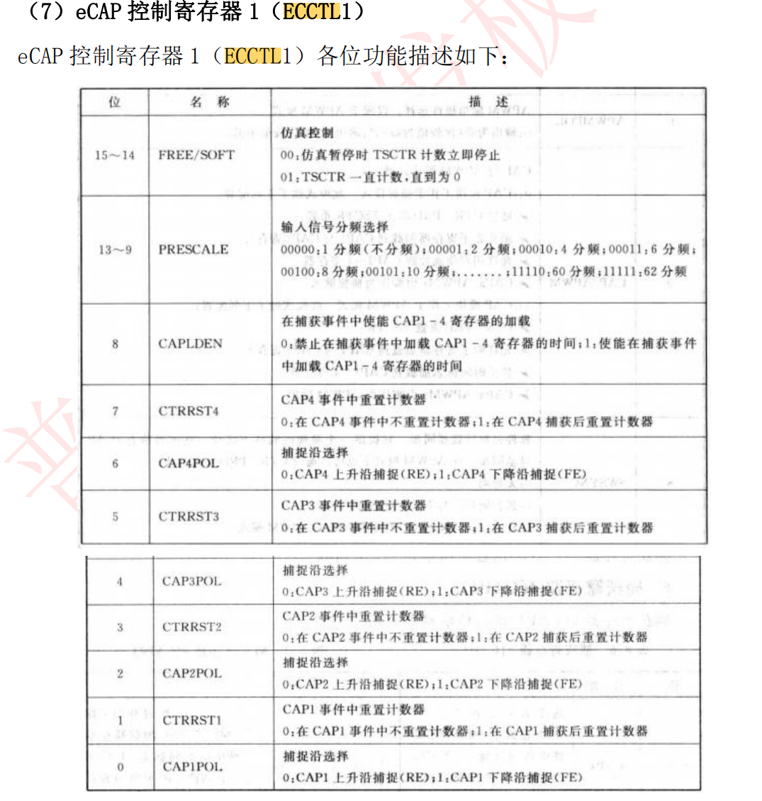

### 01-时钟系统
#### 几乎是必备的两个头文件
    #include "DSP2833x_Device.h"     // DSP2833x Headerfile Include File
    #include "DSP2833x_Examples.h"   // DSP2833x Examples Include File

    /
#### 自定义函数

    ******************************************************************
    * 函 数 名         : delay
    * 函数功能		   : 延时函数，通过循环占用CPU，达到延时功能
    * 输    入         : 无
    * 输    出         : 无
    *****************************************************************/
    void delay(void)
    {
        Uint16 		i;
        Uint32      j;
        for(i=0;i<32;i++)
            for (j = 0; j < 100000; j++);
    }

**经Debug，大约0.3s,44800649个时钟周期。**


涉及寄存器的时候，都要在EALLOW与EDIS之间处理

    void LED_Init(void)
    {
        EALLOW;//关闭写保护

        SysCtrlRegs.PCLKCR3.bit.GPIOINENCLK = 1;    // 开启GPIO时钟

        //LED1端口配置
        GpioCtrlRegs.GPCMUX1.bit.GPIO68=0;//设置为通用GPIO功能
        GpioCtrlRegs.GPCDIR.bit.GPIO68=1;//设置GPIO方向为输出
        GpioCtrlRegs.GPCPUD.bit.GPIO68=0;//使能GPIO上拉电阻

        GpioDataRegs.GPCSET.bit.GPIO68=1;//设置GPIO输出高电平

        EDIS;//开启写保护
    }

硬件图如下


主函数部分

    /******************************************************************
    * 函 数 名         : main
    * 函数功能		   : 主函数
    * 输    入         : 无
    * 输    出         : 无
    *****************************************************************/
    void main()
    {
        InitSysCtrl();//系统时钟初始化，默认已开启F28335所有外设时钟

        LED_Init();

        while(1)
        {
            GpioDataRegs.GPCTOGGLE.bit.GPIO68=1;//设置GPIO输出翻转信号
            delay();
        }

    }

### 02-LED翻转灯

在研究翻转之前，我想弄清楚翻转频率，这就涉及到基础的时钟配置思想。我们看到 main 函数开始处首先调用 InitSysCtrl()函数，该函数是 TI 公司提供的库文件 DSP2833x_SysCtrl.c 内，功能是按照需求配置系统控制寄存器值，默认将看门狗关闭，系统时钟配置为150MHZ，并分出高速时钟和低速时钟以及使能 DSP 各外设时钟。

只需要修改宏 DSP28_PLLCR 和 DSP28_DIVSEL 的值，这两个值在
“ DSP2833x_Examples.h ” 头 文 件 内 定 义 了 ， 默 认 DSP28_PLLCR是10，
DSP28_DIVSEL 是 2，即对振荡时钟 10 倍频后再 2 分频，所以等于 150MHZ。如下图所示


##### ----------------------------------------------------------------------------------------------------------------------------------------------------------
下面是InitSysCtrl内部的函数


### 03-05讲述基本的gpio操作（流水灯，蜂鸣器，继电器）
由于本文件以过例程为主，这里就不多叙述。
配置gpio十分重要，笔者另起一个md文件做详细说明

### 06-按键实验

#### 首先弄清楚原理

 

#### 其次，了解一下函数


    char KEY_Scan(char mode)
    {

	static char keyl1=1;
	static char keyl2=1;
	static char keyl3=1;
	//#define KEY_L1_SetL			(GpioDataRegs.GPBCLEAR.bit.GPIO48=1)
	//#define KEY_H1			(GpioDataRegs.GPADAT.bit.GPIO12)
	//第1列扫描
	KEY_L1_SetL;
	KEY_L2_SetH;
	KEY_L3_SetH;
	if(keyl1==1&&(KEY_H1==0||KEY_H2==0||KEY_H3==0))
	{
		DELAY_US(10000);
		keyl1=0;
		if(KEY_H1==0)
		{
			return KEY1_PRESS;
		}
		else if(KEY_H2==0)
		{
			return KEY4_PRESS;
		}
		else if(KEY_H3==0)
		{
			return KEY7_PRESS;
		}
	}
	else if(KEY_H1==1&&KEY_H2==1&&KEY_H3==1)
	{
		keyl1=1;
	}
	if(mode)
		keyl1=1;


	//第2列扫描
	KEY_L2_SetL;
	KEY_L1_SetH;
	KEY_L3_SetH;
	if(keyl2==1&&(KEY_H1==0||KEY_H2==0||KEY_H3==0))
	{
		DELAY_US(10000);
		keyl2=0;
		if(KEY_H1==0)
		{
			return KEY2_PRESS;
		}
		else if(KEY_H2==0)
		{
			return KEY5_PRESS;
		}
		else if(KEY_H3==0)
		{
			return KEY8_PRESS;
		}
	}
	else if(KEY_H1==1&&KEY_H2==1&&KEY_H3==1)
	{
		keyl2=1;
	}
	if(mode)
		keyl2=1;


	//第3列扫描
	KEY_L3_SetL;
	KEY_L1_SetH;
	KEY_L2_SetH;
	if(keyl3==1&&(KEY_H1==0||KEY_H2==0||KEY_H3==0))
	{
		DELAY_US(10000);
		keyl3=0;
		if(KEY_H1==0)
		{
			return KEY3_PRESS;
		}
		else if(KEY_H2==0)
		{
			return KEY6_PRESS;
		}
		else if(KEY_H3==0)
		{
			return KEY9_PRESS;
		}
	}
	else if(KEY_H1==1&&KEY_H2==1&&KEY_H3==1)
	{
		keyl3=1;
	}
	if(mode)
		keyl3=1;

	return KEY_UNPRESS;
}

函数中，重要的变量如下

    #define KEY_L1_SetL			(GpioDataRegs.GPBCLEAR.bit.GPIO48=1)
    #define KEY_L2_SetL			(GpioDataRegs.GPBCLEAR.bit.GPIO49=1)
    #define KEY_L3_SetL			(GpioDataRegs.GPBCLEAR.bit.GPIO50=1)

    #define KEY_L1_SetH			(GpioDataRegs.GPBSET.bit.GPIO48=1)
    #define KEY_L2_SetH			(GpioDataRegs.GPBSET.bit.GPIO49=1)
    #define KEY_L3_SetH			(GpioDataRegs.GPBSET.bit.GPIO50=1)

    #define KEY_H1			(GpioDataRegs.GPADAT.bit.GPIO12)
    #define KEY_H2			(GpioDataRegs.GPADAT.bit.GPIO13)
    #define KEY_H3			(GpioDataRegs.GPADAT.bit.GPIO14)

    #define KEY1_PRESS		1
    #define KEY2_PRESS		2
    #define KEY3_PRESS		3
    #define KEY4_PRESS		4
    #define KEY5_PRESS		5
    #define KEY6_PRESS		6
    #define KEY7_PRESS		7
    #define KEY8_PRESS		8
    #define KEY9_PRESS		9
    #define KEY_UNPRESS		0


当然，在使用按键之前需要进行初始化，初始化即gpio的配置。这一部分我们在专门的md文件中进行讲解。
### 07-中断实验与学习
#### 28335中断介绍
	F28335 的中断源可分为片内外设中断源，比如 PWM、CAP、QEP、定时器等，
	片外中断源，外部中断输入引脚 XINT1、XINT2 引入的外部中断源。
#### 先学习外部中断，用按键控制LED灯，（中断版）
	F28335 外部中断有 7 个，外部中断 1-7，其中外部中断 1 和 2 只能对 GPIO0-GPIO31 配置；
	外部中断 3 和 4、5、6、7 只对 GPIO32-GPIO63配置，它们的使用方法是一样的。
#### 编程实况-心中有数，不求甚解
##### 1-失能 CPU 级中断，并初始化 PIE 控制器寄存器和 PIE 中断向量表

	InitPieCtrl();
	IER = 0x0000;
	IFR = 0x0000;
	InitPieVectTable();

##### 2-使能 IO 口时钟，配置 IO 口为输入（同按键配置）

	LED_Init();

##### 3-设置 IO 口与中断线的映射关系

F28335 共支持 7 个外部中断 XINT1-XINT7，其中 XINT1-XINT2 只
能对 GPIO0-GPIO31 配置；XINT3-XINT7 只对 GPIO32-GPIO63 配置。所以需要选
择对应的外部中断线及 IO 口配置，比如我们 K1 它是连接在 GPIO12 上，要使用
外部中断功能可以是外部中断 1 或者外部中断 2，假如使用外部中断 1，其代码	如下

	EALLOW;
	GpioIntRegs.GPIOXINT1SEL.bit.GPIOSEL = 12;   // XINT1是GPIO12
	EDIS;

##### 4-指定中断向量表中断服务函数地址

这个通过对 PIE 中断向量表寄存器的相应位进行设置，中断服务函数名可自
定义，但是要符合 C 语言标识符命名规则，在中断函数名前需加上地址符“&”。
在对 PIE 中断向量表寄存器设置时要先声明 EALLOW，修改完成后还要声明 EDIS。
比如外部中断 1，其设置如下：

	EALLOW;	// 修改被保护的寄存器，修改前应添加EALLOW语句
	PieVectTable.XINT1 = &EXTI1_IRQn;
	EDIS;   // EDIS的意思是不允许修改被保护的寄存器

##### 5-使能外设对应的 PIE 中断

由于外设中断较多，它们是由 PIE 统一管理，所以要根据你所使用的外设中
断选择对应的组和该组内的通道，比如外部中断 1，它是由 PIE 组 1 的第 4 通道
连接，这个在前面中断介绍时讲解过。因此可由 PIE 控制寄存器中相应中断使能
位来控制。其实现代码如下所示

	PieCtrlRegs.PIEIER1.bit.INTx4 = 1; // 使能 PIE 组 1 的 INT4

下图展示了PIE管理图


##### 6-设置外部中断触发方式并使能中断

我们知道外部中断的触发方式有上升沿触发（正边沿）和下降沿触发（负边
沿），根据自己的需求来选择。当按键按下时，我们是让其输入一个低电平到
IO 口，而默认处于高电平，所以按键按下时会产生一个下降沿，因此选择下降
沿触发。外部中断的触发方式及中断使能是由 XIntruptRegs 寄存器控制，具体
实现代码如下：

	XIntruptRegs.XINT1CR.bit.POLARITY = 0; // 下降沿触发中断
	XIntruptRegs.XINT1CR.bit.ENABLE= 1; // 使能 XINT1


##### 7-使能 CPU 级中断及全局中断
这个通过对 IER 和 EINT 寄存器相应位设
置进行使能或者失能。其代码如下：

	IER |= M_INT1; // 使能 CPU 中断 1（INT1）
	EINT; // 开全局中断
	ERTM; // 当使用仿真器调试时可开启 DEBUG 中断，即使用 ERTM 语句。

##### 8-编写外部中断服务函数

配置好中断后如果有触发，即会进入中断服务函数，中断服务函数名在前面
已定义好，所以要保证一致，否则将不会进入中断服务函数内执行。在 DSP28335
软件开发中，要在中断服务函数名前加上关键字 interrupt。例如外部中断 1 的
中断服务函数

	interrupt void EXTI1_IRQn(void)
	{
	   //功能程序```
       //在中断执行结束前要清除相应的中断标志位，以等待下次中断的到来。
	}

##### 9-外部中断初始化函数 综合以上8点，并在开头加入时钟导入

	void EXTI1_Init(void)
	{
	EALLOW;
	SysCtrlRegs.PCLKCR3.bit.GPIOINENCLK = 1;    // 导入中断使能时钟 PCLKCR3   GPIO input clock
	EDIS;

	EALLOW;
	//KEY端口配置
	GpioCtrlRegs.GPAMUX1.bit.GPIO12=0;
	GpioCtrlRegs.GPADIR.bit.GPIO12=0;
	GpioCtrlRegs.GPAPUD.bit.GPIO12=0;
	GpioCtrlRegs.GPAQSEL1.bit.GPIO12 = 0;        // 外部中断1（XINT1）与系统时钟SYSCLKOUT同步

	GpioCtrlRegs.GPBMUX2.bit.GPIO48=0;
	GpioCtrlRegs.GPBDIR.bit.GPIO48=1;
	GpioCtrlRegs.GPBPUD.bit.GPIO48=0;
	GpioDataRegs.GPBCLEAR.bit.GPIO48=1;
	EDIS;

	EALLOW;
	GpioIntRegs.GPIOXINT1SEL.bit.GPIOSEL = 12;   // XINT1是GPIO12
	EDIS;

	EALLOW;	// 修改被保护的寄存器，修改前应添加EALLOW语句
	PieVectTable.XINT1 = &EXTI1_IRQn;
	EDIS;   // EDIS的意思是不允许修改被保护的寄存器

	PieCtrlRegs.PIEIER1.bit.INTx4 = 1;          // 使能PIE组1的INT4

	XIntruptRegs.XINT1CR.bit.POLARITY = 0;      // 下降沿触发中断
	XIntruptRegs.XINT1CR.bit.ENABLE= 1;        // 使能XINT1

	IER |= M_INT1;                              // 使能CPU中断1（INT1）
	EINT;                                       // 开全局中断
	ERTM;				//当使用仿真器调试时可开启 DEBUG 中断，即使用 ERTM 语句。
	}

##### 10-外部中断服务函数

初始化外部中断后，中断就已经开启了，当指定按键按下后会触发一次中断，
这时程序就会进入中断服务函数执行，所以我们还需要编写对应的 外部中断函
数，这里我们以 GPIO12 管脚的 K1 按键进行讲解，其他的按键的中断函数类似，
具体代码如下：

	interrupt void EXTI1_IRQn(void)
	{
	Uint32 i;
	for(i=0;i<10000;i++);    //键盘消抖动
	while(!KEY_H1);
	LED2_TOGGLE;
	PieCtrlRegs.PIEACK.bit.ACK1=1;//清除相应的中断标志位
	}

在 F28335 中断服务函数中，需要在中断服务函数名前加上一个关键字
“interrupt”标识为中断函数。进入中断函数后，还需要对按键进行消抖处理，
每当 K1 按键按下，D2 指示灯都会状态取反一次。最后特别注意，在中断函数执
行完成前一定要记得将相应的 PIEACKx 清零，否则下次将不再进入中断。可通过
PIE 控制寄存器的 PIEACK 中的 ACK1 写 1 来完成清零操作。

### 08-定时器中断配置

#### 中断的介绍同上文

但是要注意到TIM1 和 TIM2 产生的中断请求通过 INT13、
INT14 中断线到达 CPU，这两个中断已经预留给了实时操作系统，

	TMS320F28335 的 CPU Time 有三个，分别为 Timer0，Timer1，Timer2，其中
	Timer2 是为操作系统 DSP/BIOS 保留的，当未移植操作系统时，可用来做普通的
	定时器。这三个定时器的中断信号分别为 TINT0, TINT1, TINT2，分别对应于中
	断向量 INT1，INT13，INT14。定时器的功能如下图所示：


	从上图可知，定时器有一个预分频模块和一个定时/计数模块，其中预分频
	模块包括一个 16 位的定时器分频寄存器（TDDRH：TDDR）和一个 16 位的预定标
	计数器（PSCH：PSC）；定时/计数模块包括一个 32 位的周期寄存器（PRDH：PRD）
	和一个 32 位的计数寄存器（TIMH:TIM）。
	当系统时钟（SYSCLKOUT）来一个脉冲，PSCH：PSC 预定标计数器减 1，当 PSCH：
	PSC 预定标计数器减到 0 的时候，预定标计数器产生下溢后向定时器的 32 位计
	数器 TIMH:TIM 借位，即 TIMH:TIM 计数器减 1，同时 PSCH：PSC 可以重载定时器
	分频寄存器（TDDRH：TDDR）的值；当计数寄存器 TIMH：TIM 减到 0 产生下溢的
	时候，计数寄存器会重载周期寄存器（PRDH：PRD）的值，同时定时器会产生一
	个中断信号给 CPU。定时器的中断结构如下图所示：


#### 定时器中断配置流程（留给以后与ePWM做对比吧）

##### 1-使能定时器时钟

F28335 的 CPU 定时器的时钟是由外设时钟控制寄存器 3 所控制

	EALLOW;
	SysCtrlRegs.PCLKCR3.bit.CPUTIMER0ENCLK = 1; // CPU Timer 0
	EDIS;

##### 2-初始化定时器参数

	//指向定时器 0 的寄存器地址
	CpuTimer0.RegsAddr = &CpuTimer0Regs;
	//设置定时器 0 的周期寄存器值
	CpuTimer0Regs.PRD.all = 0xFFFFFFFF;
	//设置定时器预定标计数器值为 0
	CpuTimer0Regs.TPR.all = 0;
	CpuTimer0Regs.TPRH.all = 0;
	//确保定时器 0 为停止状态
	CpuTimer0Regs.TCR.bit.TSS = 1;
	//重载使能
	CpuTimer0Regs.TCR.bit.TRB = 1;
	// Reset interrupt counters:
	CpuTimer0.InterruptCount = 0;

##### 3-定时器的设置

这部分是Ti官方函数

	void ConfigCpuTimer(struct CPUTIMER_VARS *Timer, float Freq, float Period)
	{
	Uint32 	temp;

	// Initialize timer period:
	Timer->CPUFreqInMHz = Freq;
	Timer->PeriodInUSec = Period;
	temp = (long) (Freq * Period);
	Timer->RegsAddr->PRD.all = temp;

	// Set pre-scale counter to divide by 1 (SYSCLKOUT):
	Timer->RegsAddr->TPR.all  = 0;
	Timer->RegsAddr->TPRH.all  = 0;

	// Initialize timer control register:
	Timer->RegsAddr->TCR.bit.TSS = 1;      // 1 = Stop timer, 0 = Start/Restart Timer
	Timer->RegsAddr->TCR.bit.TRB = 1;      // 1 = reload timer
	Timer->RegsAddr->TCR.bit.SOFT = 0;
	Timer->RegsAddr->TCR.bit.FREE = 0;     // Timer Free Run Disabled
	Timer->RegsAddr->TCR.bit.TIE = 1;      // 0 = Disable/ 1 = Enable Timer Interrupt

	// Reset interrupt counter:
	Timer->InterruptCount = 0;
	}

##### 4-开启定时器中断功能，并使能定时器

	//设置定时器 0 的中断入口地址为中断向量表的 INT0
	EALLOW;
	PieVectTable.TINT0 = &TIM0_IRQn;
	EDIS;
	//开始定时器功能
	CpuTimer0Regs.TCR.bit.TSS=0;
	//开启 CPU 第一组中断并使能第一组中断的第 7 个小中断，即定时器 0
	IER |= M_INT1;
	PieCtrlRegs.PIEIER1.bit.INTx7 = 1;
	//使能总中断
	EINT;
	ERTM;	//当使用仿真器调试时可开启 DEBUG 中断，即使用 ERTM 语句。

##### 5-编写定时器中断服务函数


interrupt void TIM0_IRQn(void)
{
	EALLOW;
	LED2_TOGGLE;
	PieCtrlRegs.PIEACK.bit.ACK1=1;
	EDIS;
}


##### 6-TIMER1,2的配置

###### TIMER1

	void TIM1_Init(float Freq, float Period)
	{
	EALLOW;
	SysCtrlRegs.PCLKCR3.bit.CPUTIMER1ENCLK = 1; // CPU Timer 1
	EDIS;

	EALLOW;
	PieVectTable.XINT13 = &TIM1_IRQn;
	EDIS;

	// Initialize address pointers to respective timer registers:
	CpuTimer1.RegsAddr = &CpuTimer1Regs;
	// Initialize timer period to maximum:
	CpuTimer1Regs.PRD.all  = 0xFFFFFFFF;
	// Initialize pre-scale counter to divide by 1 (SYSCLKOUT):
	CpuTimer1Regs.TPR.all  = 0;
	CpuTimer1Regs.TPRH.all = 0;
	// Make sure timers are stopped:
	CpuTimer1Regs.TCR.bit.TSS = 1;
	// Reload all counter register with period value:
	CpuTimer1Regs.TCR.bit.TRB = 1;
	// Reset interrupt counters:
	CpuTimer1.InterruptCount = 0;

	ConfigCpuTimer(&CpuTimer1, Freq, Period);

	CpuTimer1Regs.TCR.bit.TSS=0;

	IER |= M_INT13;

	EINT;
	ERTM;

	}

	interrupt void TIM1_IRQn(void)
	{
	EALLOW;
	LED3_TOGGLE;
	EDIS;
	}

###### TIMER2

	void TIM2_Init(float Freq, float Period)
	{
	EALLOW;
	SysCtrlRegs.PCLKCR3.bit.CPUTIMER2ENCLK = 1; // CPU Timer 2
	EDIS;

	EALLOW;
	PieVectTable.TINT2 = &TIM2_IRQn;
	EDIS;

	// Initialize address pointers to respective timer registers:
	CpuTimer2.RegsAddr = &CpuTimer2Regs;
	// Initialize timer period to maximum:
	CpuTimer2Regs.PRD.all  = 0xFFFFFFFF;
	// Initialize pre-scale counter to divide by 1 (SYSCLKOUT):
	CpuTimer2Regs.TPR.all  = 0;
	CpuTimer2Regs.TPRH.all = 0;
	// Make sure timers are stopped:
	CpuTimer2Regs.TCR.bit.TSS = 1;
	// Reload all counter register with period value:
	CpuTimer2Regs.TCR.bit.TRB = 1;
	// Reset interrupt counters:
	CpuTimer2.InterruptCount = 0;

	ConfigCpuTimer(&CpuTimer2, Freq, Period);

	CpuTimer2Regs.TCR.bit.TSS=0;

	IER |= M_INT14;

	EINT;
	ERTM;

	}

	interrupt void TIM2_IRQn(void)
	{
	EALLOW;
	LED4_TOGGLE;
	EDIS;

	}

##### 7-主函数部分

		/*
	* main.c
	*
	*  Created on: 2018-3-21
	*      Author: Administrator
	*/


	#include "DSP2833x_Device.h"     // DSP2833x Headerfile Include File
	#include "DSP2833x_Examples.h"   // DSP2833x Examples Include File

	#include "leds.h"
	#include "time.h"


	/*******************************************************************************
	* 函 数 名         : main
	* 函数功能		   : 主函数
	* 输    入         : 无
	* 输    出         : 无
	*******************************************************************************/
	void main()
	{
		int i=0;

		InitSysCtrl();

		InitPieCtrl();
		IER = 0x0000;
		IFR = 0x0000;
		InitPieVectTable();

		LED_Init();
		TIM0_Init(150,500000);

		while(1)
		{
			i++;
			if(i%2000==0)
			{
				LED1_TOGGLE;
			}
			DELAY_US(100);
		}
	}

### 09-eCAP捕获ePWM实验
#### 基本原理其实就是捕获上升沿或者下降沿，然后进行计算。
具体的捕获方法还是得回归实体纸质书，电子资料竟然没有，神奇。下面就代码进行初步讲解吧。
#### 配制代码
##### 1-使能 eCAP 外设时钟

	EALLOW;
	SysCtrlRegs.PCLKCR1.bit.ECAP1ENCLK = 1; // eCAP1
	EDIS;

##### 2-初始化 GPIO 为 eCAP1 功能，即选择 GPIO 复用功能

	void InitECap1Gpio(void);

本章实验例程内使用的 eCAP1 对应的是 GPIO24 脚

##### 3-eCAP 外设相关参数设置

	//配制内为什么既有ECCTL1也有ECCTL2，是因为两者的功能不同，具体参考相关文件即可





	ECap1Regs.ECEINT.all = 0x0000;             // 禁用所有捕获中断
	ECap1Regs.ECCLR.all = 0xFFFF;              // 清除所有CAP中断标志
	ECap1Regs.ECCTL1.bit.CAPLDEN = 0;          // 禁用CAP1-CAP4寄存器
	ECap1Regs.ECCTL2.bit.TSCTRSTOP = 0;        // 确保计数器已停止

	// Configure peripheral registers
	ECap1Regs.ECCTL2.bit.CONT_ONESHT = 1;      // 单次触发
	ECap1Regs.ECCTL2.bit.STOP_WRAP = 3;        // 在4个事件处停止(与原理密切相关)
	ECap1Regs.ECCTL1.bit.CAP1POL = 1;          // Falling edge 下降沿捕获
	ECap1Regs.ECCTL1.bit.CAP2POL = 0;          // Rising edge  上升沿捕获
	ECap1Regs.ECCTL1.bit.CAP3POL = 1;          // Falling edge 下降沿捕获
	ECap1Regs.ECCTL1.bit.CAP4POL = 0;          // Rising edge  上升沿捕获
	ECap1Regs.ECCTL1.bit.CTRRST1 = 1;          // 1-差分运算；0-绝对时间运算 下同 见实体书
	ECap1Regs.ECCTL1.bit.CTRRST2 = 1;          // 
	ECap1Regs.ECCTL1.bit.CTRRST3 = 1;          // 
	ECap1Regs.ECCTL1.bit.CTRRST4 = 1;          // 
	ECap1Regs.ECCTL2.bit.SYNCI_EN = 1;         // 在中启用同步
	ECap1Regs.ECCTL2.bit.SYNCO_SEL = 0;        // Pass through


	ECap1Regs.ECCTL1.bit.CAPLDEN = 1;          // 启用捕获单元


	ECap1Regs.ECCTL2.bit.TSCTRSTOP = 1;        // 启动计数器//接下来都是原理
	ECap1Regs.ECCTL2.bit.REARM = 1;            // arm one-shot 
	ECap1Regs.ECCTL1.bit.CAPLDEN = 1;          // 启用CAP1-CAP4寄存器加载
	ECap1Regs.ECEINT.bit.CEVT4 = 1;            // 4个事件-中断

	EALLOW;  // 
	PieVectTable.ECAP1_INT = &ecap1_isr; //编写中断服务函数
	EDIS;    // 

	// 启用连接到ECAP1-4 INT的CPU INT4
	IER |= M_INT4;        
	// 启用PIE中的eCAP INTn：第3组中断1-6
	PieCtrlRegs.PIEIER4.bit.INTx1 = 1;

	// 启用全局中断和更高优先级的实时调试事件：
	EINT;   // 启用全局中断INTM
	ERTM;   // 启用全局实时中断DBGM,当使用仿真器调试时可开启 DEBUG 中断，即使用 ERTM 语句。

##### 4-初始化ePWM
本来需及时去编写中断服务函数，但考虑学习顺序，本次的中断服务函数有点麻烦，所以先讲述清楚ePWM的配置。例程使用的是 ePWM5A
产生一个 PWM 信号，因此需要对 PWM 模块进行配置

	void EPWM5_Init(Uint16 tbprd)
	{
		EALLOW;
		SysCtrlRegs.PCLKCR0.bit.TBCLKSYNC = 0;//要使用 ePWM 外设，则需要使能它的时钟，并且先要关闭 TB 时基模块的时钟，最后在开启。
		SysCtrlRegs.PCLKCR1.bit.EPWM5ENCLK = 1;  // ePWM5
		EDIS;

		InitEPwm5Gpio();

		EPwm5Regs.TBCTL.bit.CTRMODE = TB_COUNT_UP; // Count up
		EPwm5Regs.TBPRD = tbprd;
		EPwm5Regs.TBPHS.all = 0x00000000;
		EPwm5Regs.AQCTLA.bit.PRD = AQ_TOGGLE;      // 翻转

		// TBCLK = SYSCLKOUT
		EPwm5Regs.TBCTL.bit.HSPCLKDIV = 1; 
		EPwm5Regs.TBCTL.bit.CLKDIV = 0;    //二分频

		EALLOW;
		SysCtrlRegs.PCLKCR0.bit.TBCLKSYNC = 1;
		EDIS;
	}
实测来讲，效果一般，且不知道怎么修改占空比（修改不了，甚是奇怪）
于是改用配置齐全的EPWM1A 即IO0做捕获引脚
配置代码如下

	void EPWM1_Init(Uint16 tbprd)
	{
	EALLOW;
	SysCtrlRegs.PCLKCR0.bit.TBCLKSYNC = 1;   // Disable TBCLK within the ePWM
	SysCtrlRegs.PCLKCR1.bit.EPWM1ENCLK = 1;  // ePWM1
	EDIS;

	InitEPwm1Gpio();
	InitTzGpio();

	//////////////////////////////以下3个IO口设置为输出，作为列扫描////////////////////////////
	EALLOW;
	//初始化行1的GPIO48
	GpioCtrlRegs.GPBPUD.bit.GPIO48 = 0;   									// Enable pullup on GPIO48
	GpioDataRegs.GPBCLEAR.bit.GPIO48 = 1;   									// Load output latch
	GpioCtrlRegs.GPBMUX2.bit.GPIO48 = 0;  									// GPIO48 = GPIO
	GpioCtrlRegs.GPBDIR.bit.GPIO48 = 1;   									// GPIO48 = output

	//初始化行2的GPIO49
	GpioCtrlRegs.GPBPUD.bit.GPIO49 = 0;   									// Enable pullup on GPIO49
	GpioDataRegs.GPBCLEAR.bit.GPIO49 = 1;   									// Load output latch
	GpioCtrlRegs.GPBMUX2.bit.GPIO49 = 0;  									// GPIO49 = GPIO
	GpioCtrlRegs.GPBDIR.bit.GPIO49 = 1;   									// GPIO49 = output

	//初始化行3的GPIO50
	GpioCtrlRegs.GPBPUD.bit.GPIO50 = 0;   									// Enable pullup on GPIO50
	GpioDataRegs.GPBCLEAR.bit.GPIO50 = 1;   									// Load output latch
	GpioCtrlRegs.GPBMUX2.bit.GPIO50 = 0;  									// GPIO50 = GPIO
	GpioCtrlRegs.GPBDIR.bit.GPIO50 = 1;   									// GPIO50 = output
	EDIS;

	// Interrupts that are used in this example are re-mapped to
	// ISR functions found within this file.
	EALLOW;  // This is needed to write to EALLOW protected registers
	PieVectTable.EPWM1_TZINT = &epwm1_tzint_isr;
	EDIS;    // This is needed to disable write to EALLOW protected registers

	EALLOW;
	SysCtrlRegs.PCLKCR0.bit.TBCLKSYNC = 0;      // Stop all the TB clocks
	EDIS;

	// Enable TZ1 and TZ2 as one shot trip sources
	EALLOW;
	EPwm1Regs.TZSEL.bit.OSHT1 = 1;
	EPwm1Regs.TZSEL.bit.OSHT2 = 1;

	// What do we want the TZ1 and TZ2 to do?
	EPwm1Regs.TZCTL.bit.TZA = TZ_FORCE_HI;
	EPwm1Regs.TZCTL.bit.TZB = TZ_FORCE_LO;

	// Enable TZ interrupt
	EPwm1Regs.TZEINT.bit.OST = 1;
	EDIS;

	// Setup Sync
	EPwm1Regs.TBCTL.bit.SYNCOSEL = TB_SYNC_DISABLE;  // Pass through
	// Allow each timer to be sync'ed
	EPwm1Regs.TBCTL.bit.PHSEN = TB_DISABLE;
	EPwm1Regs.TBPHS.half.TBPHS = 0;
	EPwm1Regs.TBCTR = 0x0000;                  // Clear counter
	EPwm1Regs.TBPRD = tbprd;
	EPwm1Regs.TBCTL.bit.CTRMODE = TB_COUNT_UP;
	EPwm1Regs.TBCTL.bit.HSPCLKDIV=1;
	EPwm1Regs.TBCTL.bit.CLKDIV=0;

	// Setup shadow register load on ZERO
	EPwm1Regs.CMPCTL.bit.SHDWAMODE = CC_SHADOW;
	EPwm1Regs.CMPCTL.bit.SHDWBMODE = CC_SHADOW;
	EPwm1Regs.CMPCTL.bit.LOADAMODE = CC_CTR_ZERO;
	EPwm1Regs.CMPCTL.bit.LOADBMODE = CC_CTR_ZERO;

	// Set Compare values
	EPwm1Regs.CMPA.half.CMPA = 0;    // Set compare A value
	EPwm1Regs.CMPB = 0;              // Set Compare B value

	// Set actions
	EPwm1Regs.AQCTLA.bit.ZRO = AQ_SET;            // Set PWM1A on Zero
	EPwm1Regs.AQCTLA.bit.CAU = AQ_CLEAR;          // Clear PWM1A on event A, up count
	EPwm1Regs.AQCTLB.bit.ZRO = AQ_CLEAR;            // Set PWM1B on Zero
	EPwm1Regs.AQCTLB.bit.CAU = AQ_SET;          // Clear PWM1B on event B, up count


	EALLOW;
	SysCtrlRegs.PCLKCR0.bit.TBCLKSYNC = 1;         // Start all the timers synced
	EDIS;

	// Enable CPU INT3 which is connected to EPWM1-3 INT:
	IER |= M_INT2;

	// Enable EPWM INTn in the PIE: Group 3 interrupt 1-3
	PieCtrlRegs.PIEIER2.bit.INTx1 = 1;

	// Enable global Interrupts and higher priority real-time debug events:
	EINT;   // Enable Global interrupt INTM
	ERTM;   // Enable Global realtime interrupt DBGM
	}


##### 5-编写中断服务函数


	__interrupt void ecap1_isr(void)
	{
	// Cap input is syc'ed to SYSCLKOUT so there may be
	// a +/- 1 cycle variation

	if(ECap1Regs.CAP2 > EPwm5Regs.TBPRD*2+1 || ECap1Regs.CAP2 < EPwm5Regs.TBPRD*2-1)
	{
		Fail();
	}

	if(ECap1Regs.CAP3 > EPwm5Regs.TBPRD*2+1 || ECap1Regs.CAP3 < EPwm5Regs.TBPRD*2-1)
	{
		Fail();
	}

	if(ECap1Regs.CAP4 > EPwm5Regs.TBPRD*2+1 || ECap1Regs.CAP4 < EPwm5Regs.TBPRD*2-1)
	{
		Fail();
	}

	ECap1IntCount++;

	/*   if(EPwm5TimerDirection == EPWM_TIMER_UP)
	{
			if(EPwm5Regs.TBPRD < PWM5_TIMER_MAX)
			{
			EPwm5Regs.TBPRD++;
			}
			else
			{
			EPwm5TimerDirection = EPWM_TIMER_DOWN;
			EPwm5Regs.TBPRD--;
			}
	}
	else
	{
			if(EPwm5Regs.TBPRD > PWM5_TIMER_MIN)
			{
			EPwm5Regs.TBPRD--;
			}
			else
			{
			EPwm5TimerDirection = EPWM_TIMER_UP;
			EPwm5Regs.TBPRD++;
			}
	}*/
	cap1reg[index_1++]=ECap1Regs.CAP1;
	if(index_1>=50)
	{
		index_1=0;
	}
	mincap1=cap1reg[0];
	for(min=0;min==49;min++)
	{
		if (cap1reg[min]<mincap1)
			mincap1=cap1reg[min];
	}
	temp=mincap1;
	if(temp<1000)
	{
		min_in1000=1;
	}
	if(temp<500)
		{
			min_in500=1;
		}
	if(temp<100)
		{
			min_in100=1;
		}
	if(temp<30)
		{
			min_in30=1;
		}
	ECap1PassCount++;

	ECap1Regs.ECCLR.bit.CEVT4 = 1;
	ECap1Regs.ECCLR.bit.INT = 1;
	ECap1Regs.ECCTL2.bit.REARM = 1;

	// Acknowledge this interrupt to receive more interrupts from group 4
	PieCtrlRegs.PIEACK.all = PIEACK_GROUP4;
	}

##### 6-编写主函数

	void main()
	{


	InitSysCtrl();
	InitPieCtrl();
	IER = 0x0000;
	IFR = 0x0000;
	InitPieVectTable();

	LED_Init();
	TIM0_Init(150,200000);//200ms
	UARTa_Init(4800);

	//EPWM5_Init(PWM5_TIMER_MIN);  //ePWM在约9375Hz与7500000Hz之间变化
	EPWM1_Init(9999);
	eCAP1_Init();
	/*	EPwm5A_SetCompare(2500);*/
		while(1)
			{
	    	EPwm1A_SetCompare(3000);

			}
	}

计算得出，ePWM1A的输出频率是7.5kHz（增计数模式）占空比是30%


我们的捕捉成果如下


可以看出，

	20000/150Mhz=7.5kHz

	6000/6000+14000 = 30%

捕捉成功！

