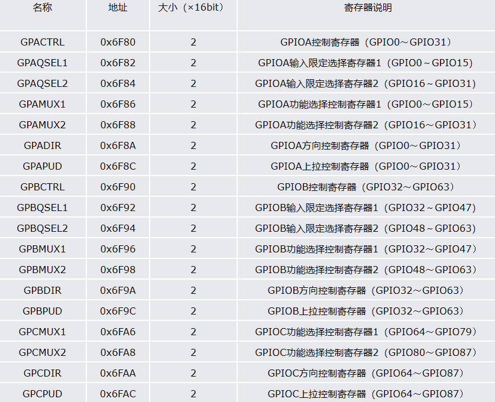
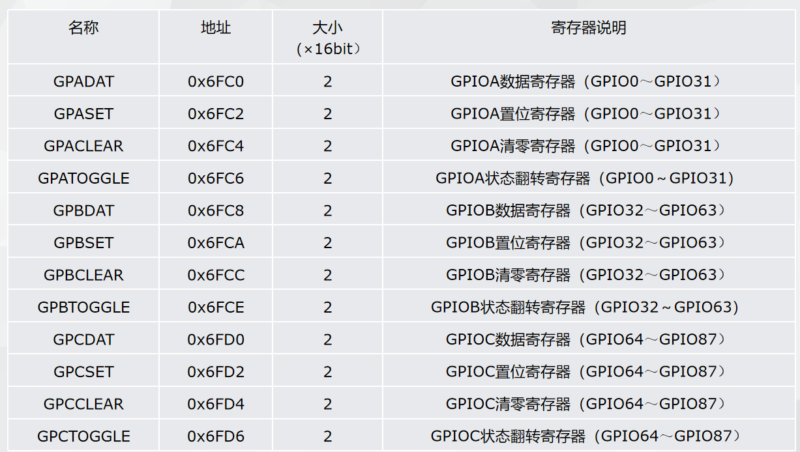
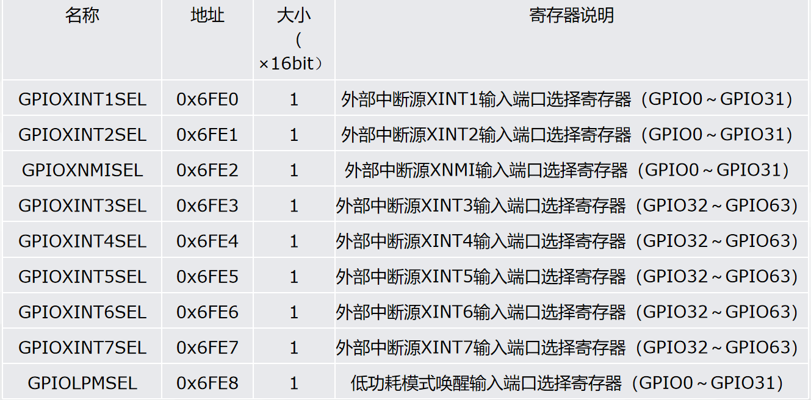
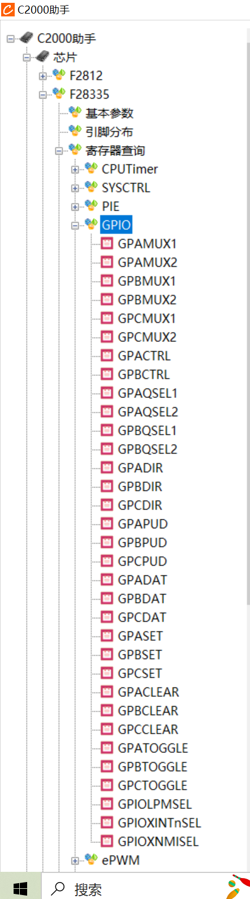
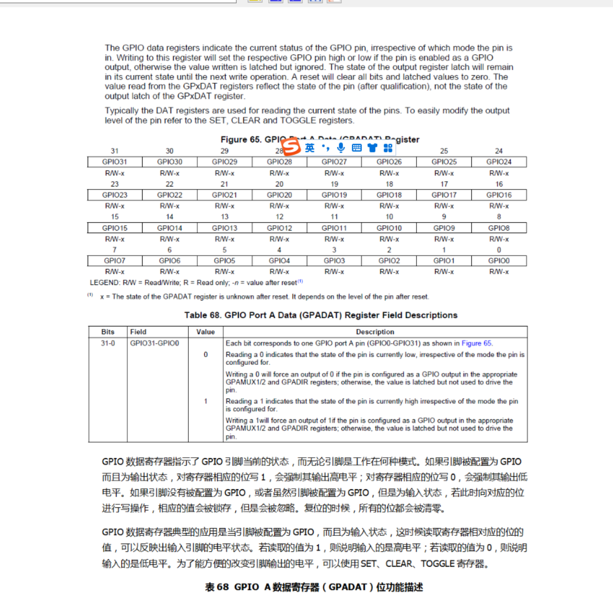
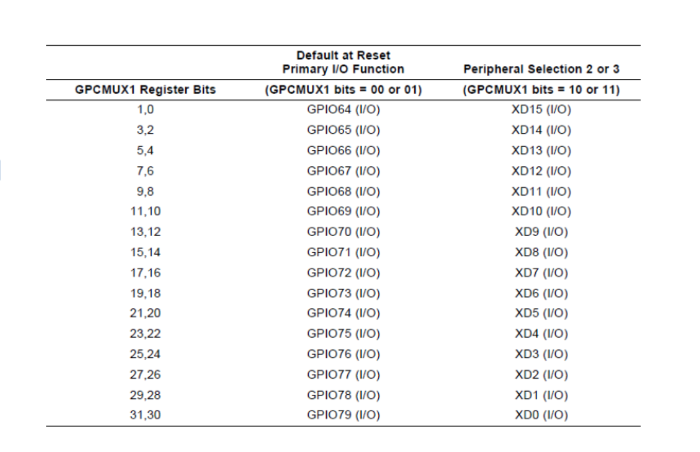
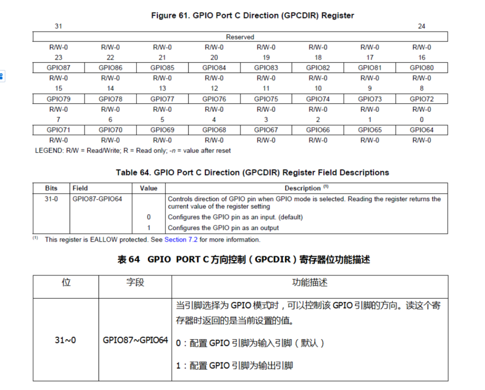
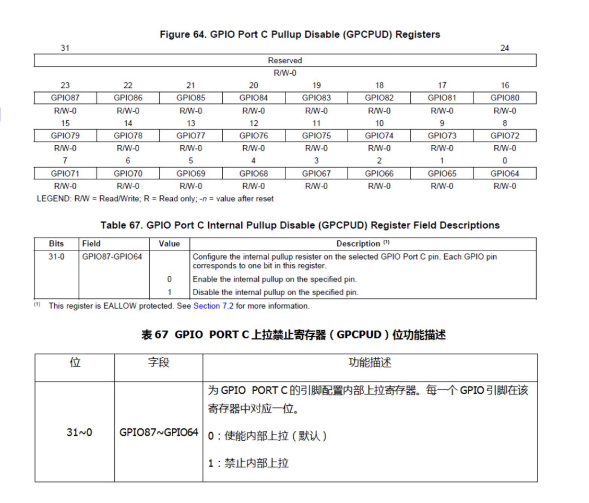
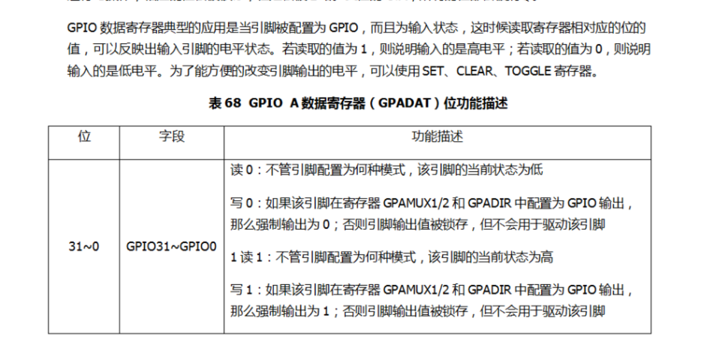

# 总结-GPIO配置总思路
下面总结下，如何正确使用一个GPIO引脚，可以参照如下顺序进行配置：

    1.选择GPIO工作模式：首先需要搞清每个GPIO引脚所具有的功能，并通过GPxMUXn寄存器选择让其工作在通用数字I/O模式，还是工作在某种外设功能模式。默认情况下，DSP上电时，GPIO被配置成通用数字I/O模式，且为输入引脚。
    2.使能或禁止内部上拉电阻。具有ePWM输出功能的GPIO0～GPIO11的内部上拉功能默认是禁止的，其他引脚的内部上拉功能默认是使能的。
    3.如果引脚是作输入用的，那需要为引脚配置输入限定模式。默认情况下，所有输入引脚的限定模式是与SYSCLKOUT同步，当然也可以通过相关的寄存器选择其他的输入限定模式，比如采样窗限定。
    4.如果引脚被配置为通用数字I/O口，那么还需要通过GPxDIR寄存器来设定该引脚是做输入还是做输出，也就是要选择引脚方向。
    5.如果引脚被配置为通用数字I/O口，并且方向是输出的话，可以通过GPxSET或者GPxCLEAR寄存器来设定引脚的初始电平。
通过上面五个步骤，基本完成了GPIO引脚的初始化工作。
（这5点可以先看看后文再回来看，源于C2000课程。其中第三点见到的少）

## 本文专门做一个gpio配置的说明
### 首先是要分清楚什么时候要进行EALLWO和EDIS的保护

    对于F28335输入/输出引脚的操作，都是通过对寄存器的设置来实现的。例如，选择某个引脚功能是做外设引脚还是做通用数字I/O口，当引脚作为通用数字I/O口时，是做输入还是做输出，如何使其输出高电平或者低电平，如何使其引脚电平翻转，如何知道引脚上的电平是高或者是低，这些都是通过对GPIO寄存器的操作来实现的，每个I/O引脚都可以通过寄存器相应的位得到设置。GPIO的寄存器分成了三大类，第一类是控制寄存器，主要由功能选择控制寄存器GPxMUXn、方向控制寄存器GPxDIR、输入限定控制寄存器GPxQSELn等组成，x代表A、B、C，n代表1或者2，见图1；第二类是数据寄存器，主要由数据寄存器GPxDAT、置位寄存器GPxSET、清除寄存器GPxCLEAR和状态翻转寄存器GPxTOGGLE等组成，见图2；第三类是外部中断源及低功耗模式唤醒选择寄存器，比如外部中断源XINT1输入端口选择寄存器GPIOXINT1SEL，见表图3。需要注意的是第一类和第三类寄存器是受EALLOW保护的，也就是说对这些寄存器进行设置时，在操作前需要写EALLOW，在操作完成后要写EDIS，否则操作是无效的。第二类寄存器没有这个限制

    图1：控制寄存器

    图2：数据寄存器

    图3：外部中断寄存器

### 其次，我们结合具体的功能助手来研究

这里推荐C2000助手，因为有全部寄存器配置，以及中文翻译

    图4：C2000助手

比如，后文中用到的数据读取

    图5：C2000助手数据读取 DAT

非常方便理解

### 最后，我们结合代码进行深入学习，着手实践

#### led灯的gpio配置（基于普中科技）

    void LED_Init(void)
    {
	EALLOW;
	SysCtrlRegs.PCLKCR3.bit.GPIOINENCLK = 1;// 开启GPIO时钟

	//LED1端口配置
	GpioCtrlRegs.GPCMUX1.bit.GPIO68=0;//设置为通用GPIO功能
	GpioCtrlRegs.GPCDIR.bit.GPIO68=1;//设置GPIO方向为输出
	GpioCtrlRegs.GPCPUD.bit.GPIO68=0;//使能GPIO上拉电阻

在LED1端口配置中，我们见识到了，首先是GpioCtrlReg，这就是前面说的第一类控制寄存器，需要EALLOW保护，此外，我们看看GPCMUX1这个寄存器，我们用C2000助手打开。
注意，这部分内容应该是在数据手册的GPIO MUX中

    图6：C2000助手数据读取 MUX

同样，我们进行GPCDIR配置

    图7：C2000助手数据读取 DIR

最后上拉电阻

    图8：C2000助手数据读取 PUD

至此，LED1端口配置完成

	//LED2端口配置
	GpioCtrlRegs.GPCMUX1.bit.GPIO67=0;
	GpioCtrlRegs.GPCDIR.bit.GPIO67=1;
	GpioCtrlRegs.GPCPUD.bit.GPIO67=0;

	//LED3端口配置
	GpioCtrlRegs.GPCMUX1.bit.GPIO66=0;
	GpioCtrlRegs.GPCDIR.bit.GPIO66=1;
	GpioCtrlRegs.GPCPUD.bit.GPIO66=0;

	//LED4端口配置
	GpioCtrlRegs.GPCMUX1.bit.GPIO65=0;
	GpioCtrlRegs.GPCDIR.bit.GPIO65=1;
	GpioCtrlRegs.GPCPUD.bit.GPIO65=0;

	//LED5端口配置
	GpioCtrlRegs.GPCMUX1.bit.GPIO64=0;
	GpioCtrlRegs.GPCDIR.bit.GPIO64=1;
	GpioCtrlRegs.GPCPUD.bit.GPIO64=0;

	//LED6端口配置
	GpioCtrlRegs.GPAMUX1.bit.GPIO10=0;
	GpioCtrlRegs.GPADIR.bit.GPIO10=1;
	GpioCtrlRegs.GPAPUD.bit.GPIO10=0;

	//LED7端口配置
	GpioCtrlRegs.GPAMUX1.bit.GPIO11=0;
	GpioCtrlRegs.GPADIR.bit.GPIO11=1;
	GpioCtrlRegs.GPAPUD.bit.GPIO11=0;

其他的也如此配置，最后高电平输出即可
其实这里只涉及第二类寄存器，所以也不需要EDIS

	GpioDataRegs.GPCSET.bit.GPIO68=1;
	GpioDataRegs.GPCSET.bit.GPIO67=1;
	GpioDataRegs.GPCSET.bit.GPIO66=1;
	GpioDataRegs.GPCSET.bit.GPIO65=1;
	GpioDataRegs.GPCSET.bit.GPIO64=1;
	GpioDataRegs.GPASET.bit.GPIO10=1;
	GpioDataRegs.GPASET.bit.GPIO11=1;

	EDIS;
    }

#### 蜂鸣器配置

配置内容几乎一样

    void BEEP_Init(void)
    {
	EALLOW;
	SysCtrlRegs.PCLKCR3.bit.GPIOINENCLK = 1;// 开启GPIO时钟
	//BEEP端口配置
	GpioCtrlRegs.GPAMUX1.bit.GPIO6=0;
	GpioCtrlRegs.GPADIR.bit.GPIO6=1;
	GpioCtrlRegs.GPAPUD.bit.GPIO6=0;

	EDIS;

	GpioDataRegs.GPACLEAR.bit.GPIO6=1;

    }
    
#### 按键配置（9键盘）

其实仔细看来也是大同小异，不过我们后面涉及到对DAT的读取，所以gpio12,13,14设置为了输入

    void KEY_Init(void)
    {
	EALLOW;
	SysCtrlRegs.PCLKCR3.bit.GPIOINENCLK = 1;// 开启GPIO时钟

	//KEY端口配置
	GpioCtrlRegs.GPAMUX1.bit.GPIO12=0;
	GpioCtrlRegs.GPADIR.bit.GPIO12=0;
	GpioCtrlRegs.GPAPUD.bit.GPIO12=0;

	GpioCtrlRegs.GPAMUX1.bit.GPIO13=0;
	GpioCtrlRegs.GPADIR.bit.GPIO13=0;
	GpioCtrlRegs.GPAPUD.bit.GPIO13=0;

	GpioCtrlRegs.GPAMUX1.bit.GPIO14=0;
	GpioCtrlRegs.GPADIR.bit.GPIO14=0;
	GpioCtrlRegs.GPAPUD.bit.GPIO14=0;

	GpioCtrlRegs.GPBMUX2.bit.GPIO48=0;
	GpioCtrlRegs.GPBDIR.bit.GPIO48=1;
	GpioCtrlRegs.GPBPUD.bit.GPIO48=0;

	GpioCtrlRegs.GPBMUX2.bit.GPIO49=0;
	GpioCtrlRegs.GPBDIR.bit.GPIO49=1;
	GpioCtrlRegs.GPBPUD.bit.GPIO49=0;

	GpioCtrlRegs.GPBMUX2.bit.GPIO50=0;
	GpioCtrlRegs.GPBDIR.bit.GPIO50=1;
	GpioCtrlRegs.GPBPUD.bit.GPIO50=0;

	EDIS;

	GpioDataRegs.GPBSET.bit.GPIO48=1;
	GpioDataRegs.GPBSET.bit.GPIO49=1;
	GpioDataRegs.GPBSET.bit.GPIO50=1;

    }

我们看一看具体的采集代码

    #define KEY_L1_SetL			(GpioDataRegs.GPBCLEAR.bit.GPIO48=1)
    #define KEY_L2_SetL			(GpioDataRegs.GPBCLEAR.bit.GPIO49=1)
    #define KEY_L3_SetL			(GpioDataRegs.GPBCLEAR.bit.GPIO50=1)

    #define KEY_L1_SetH			(GpioDataRegs.GPBSET.bit.GPIO48=1)
    #define KEY_L2_SetH			(GpioDataRegs.GPBSET.bit.GPIO49=1)
    #define KEY_L3_SetH			(GpioDataRegs.GPBSET.bit.GPIO50=1)

    #define KEY_H1			(GpioDataRegs.GPADAT.bit.GPIO12)
    #define KEY_H2			(GpioDataRegs.GPADAT.bit.GPIO13)
    #define KEY_H3			(GpioDataRegs.GPADAT.bit.GPIO14)

GpioDataRegs.GPADAT.bit.GPIO12的实现见下图

    图9：C2000助手数据读取 DAT

